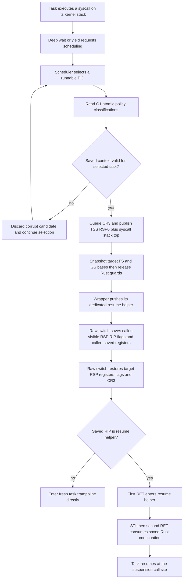

<!-- For God so loved the world, that he gave his only begotten Son, that whosoever believeth in him should not perish, but have everlasting life. — John 3:16 (KJV) -->

# Stackful Context-Switch Workflow Chirho

Each task owns a kernel stack. A task may suspend inside a deep syscall and
must resume on the same Rust continuation. Scheduler selection therefore uses
only scheduler/task state and lock-free classifications; it must never acquire
VFS, `FileChirho`, `InodeChirho`, or socket locks that a suspended task may own.

For a fresh task, `CpuContextChirho.rsp_chirho` may be the stack top or a fork
frame within the stack, and `rip_chirho` is its kernel entry trampoline. For a
resumed task, `rip_chirho` is `switch_context_return_resume_chirho` and the
word at `rsp_chirho` is the second return address into the suspended Rust
frame. Validation checks the selected task's exact stack bounds before reading
that word and requires both instruction addresses to be mapped supervisor,
executable pages.

`set_tss_rsp0_chirho` and `set_page_fault_ist_chirho` mutate the initialized
`TaskStateSegment` inside its `Lazy` storage. Callers must never cast the
address of the `Lazy` wrapper itself to a TSS pointer.
