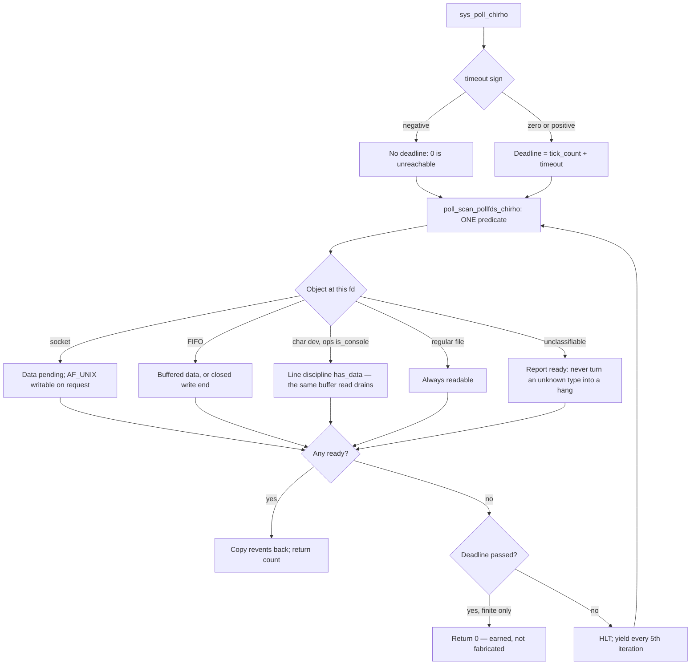
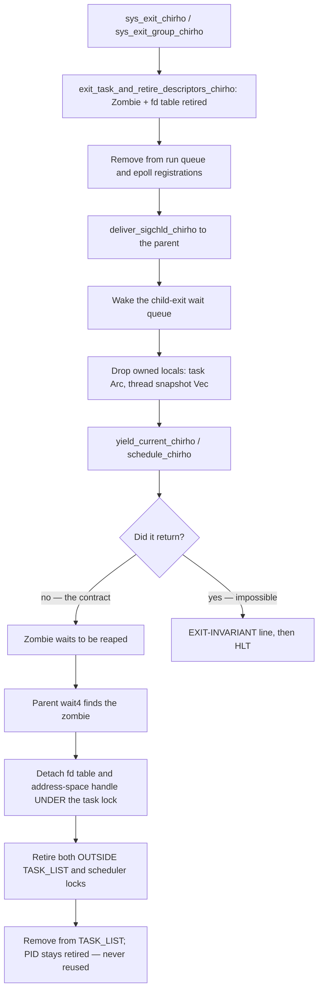

<!-- For God so loved the world, that he gave his only begotten Son, that whosoever believeth in him should not perish, but have everlasting life. — John 3:16 (KJV) -->

# Process exit lifecycle Chirho

This workflow owns how a user task blocks, how it dies, and how its parent
learns about it. Those three are one workflow because a defect in the first
produced a workaround in the second that hid a bug in the third for the whole
life of the boot shell.

The governing rule: **no exit decision may be made from a PID value.** PID is an
identity, not a role. Every numeric role test that lived on this path
misclassified something.

That rule is the target, **not yet the state of the code.** `exit` and
`exit_group` now satisfy it; `sys_select` does not. Read the RED section before
treating any of this as green.

## Blocking contract (precondition for everything below)

**No blocking call may manufacture a timeout.** "Block indefinitely" (a negative
`poll` timeout, a NULL `select` `timeval`) may not return `0`; a zero timeout
means a single non-blocking scan; a positive timeout may return `0` only once its
deadline has genuinely passed, measured against the timer-ISR tick counter.

`poll` and `select` share one primitive, `poll_deadline_expired_chirho`. A second
deadline implementation would be a second place to get this wrong, and both calls
were wrong here in different ways before they shared it.

**Precedence on the ordinary return path: READY, then SIGNAL, then earned
TIMEOUT.**

Scoped deliberately, and the scope is not a formality: the forced-exit edge below
runs after the sleep and BEFORE the pass's readiness scan, and can return `0`
without reaching it. So this is the rule for a normal `select` return, not an
invariant of every trip through the loop — and a directed test using an ordinary
descriptor proves the former, never the latter.

Ready first, because Linux returns `retval > 0` without ever consulting
`signal_pending`. Signal before timeout, because `core_sys_select` tests
`signal_pending` BEFORE accepting a zero from `do_select` — so a signal pending
on entry beats an all-zero timeout, and a signal concurrent with a finite expiry
beats the expiry.

The ordering lives in WHERE the scan sits, not in a stack of three tests. The
single scan of a pass is at the BOTTOM of the wait loop, after the sleep, and
returns immediately if anything is ready; control reaches the signal and deadline
tests only having just established that nothing is. Readiness is therefore always
decided on fresher information than either.

Both halves of this were got wrong in sequence, each by the fix for the other:

- adding a deadline put the timeout test ABOVE the signal test, so an all-zero
  timeout with a signal pending returned `0`;
- fixing that left a SECOND signal test after the sleep and before the scan, so a
  descriptor and a signal arriving during one sleep returned `EINTR` and dropped
  the ready descriptor.

A new early return in a wait loop re-ranks every condition that could already end
that wait. Preserving those conditions somewhere below it is not preserving their
precedence.

This mattered far beyond `poll`. When it returned `0` to an indefinite wait,
BusyBox read that impossible result as the end of its line-edit wait and exited
cleanly — which is what the exit-path workarounds below were built to paper over.

`select` was worse than `poll` had been: it did not implement the timeout at all.
`timeout_ptr_chirho` reached only the parameter list and one `if ptr == 0 {}`
with an empty body, so no `timeval` was ever read and no deadline ever existed.
Every empty return it produced was fabricated *by construction* — `{5, 0}` and
`NULL` were indistinguishable to it. It now decodes the `timeval`, converts to
ticks, and blocks on the shared predicate.

**In `poll`**, readiness is a property of the **object** behind a descriptor,
never of the descriptor NUMBER and never of the polling process. One predicate
serves the first pass and every retry pass; divergent readiness copies are the
defect, because an object can then be ready to one pass and invisible to another.

That sentence is scoped deliberately. It is a property of `poll` after `9893b82`,
**not a kernel-wide rule, and it is false of `select`**, whose
`fd_is_read_ready_chirho` still branches on `fd_chirho == 0`, consults
`is_interactive_shell_chirho()`, probes the raw UART LSR and hardcodes TCP port
2222 — every construct the poll slice removed. The timeout repair did not touch
it. See RED below.

Sharing a deadline primitive is not the same as sharing a readiness predicate,
and writing the second claim while only the first was true is the mistake this
document has now made twice: first "no exit decision may be made from a PID
value" as a rule when it was a property of two repaired functions, then this one
a paragraph away. What is repaired belongs in the past tense of the function that
was repaired; what is still open belongs in RED.

The yield inside that loop is an **internal scheduler handoff**. It must not
become a return value. Leaking it out as `0` is precisely the defect that made
`poll(-1)` answer a timeout.

## Console identity

The console has two representations: the devtmpfs node for `/dev/console`
(major 5, minor 0 or 1, carrying `DevNodeDataChirho`), and the boot stdio
objects installed by init, which reuse a dummy inode with `fs_data_chirho: None`.

Both carry `DEV_CONSOLE_OPS_CHIRHO`, so **identity lives on the ops object**
(`FileOpsChirho::is_console_chirho`). Discriminating on inode payload finds the
first and misses the second — the fd 0 that every shell actually polls — which
leaves the predicate decorative exactly where it matters.

## Exit

One path for `exit` and `exit_group` — but **not yet for every route out of a
task.** See the RED section below: `sys_select` can still terminate a task from
inside a numeric PID test. The diagram describes the unified path, not a
property the whole kernel currently holds.

Two rules on this diagram are load-bearing:

- **Drop owned locals before the handoff.** These functions never return, so
  their frames never unwind. A task `Arc` or a heap `Vec` left alive there is
  leaked permanently even after reap removes the task — a bounded-growth defect
  distinct from fd or page-table retirement.
- **The impossible return must be loud.** Silently entering `HLT` makes a
  violated invariant indistinguishable from any other hang. The
  `EXIT-INVARIANT` line names the PID and which scheduler call returned. It is
  a permanent failing input, not a temporary trace.

## SIGCHLD has no ppid==0 sentinel

`deliver_sigchld_chirho` must not treat parent PID `0` as "no parent". **PID 0
is a real task here — it is the user login shell.** Treating it as a sentinel
silently discarded SIGCHLD for every child the boot shell forked, so it never
reaped them and boot stalled. The lookup that follows already handles a
genuinely absent parent, which made the guard both wrong and redundant.

This is the concrete cost of inferring roles from PID values, and it is why the
re-exec workarounds existed at all: the kernel could not notify the shell, so it
faked forward progress by killing the parent and re-execing a shell in the
corpse's context.

## Removed, and why they must not come back

| Removed | Why it existed | Why it was wrong |
| --- | --- | --- |
| `sys_exit` post-yield BusyBox relaunch | Restart a shell that "had no parent" | Nothing tested for a parent; it ran after every exit that resumed, and hid a scheduled Zombie |
| `exit_group` `PID < 3` split | Treat PID 1/2 as the boot shell | The shell is PID 0; it caught an ordinary `mkdir -p` child and destroyed its parent |
| `wait4` fast path (`parent_pid` 3..=7) | Avoid a "slow" xkbcomp | xkbcomp was broken, not slow; this SIGKILLed it and fabricated exit status 0 |
| `ppid == 0` SIGCHLD sentinel | "init has no parent to notify" | PID 0 is the login shell; this was the blocker under all of the above |
| `select`'s four fabricated zeros | Hand the CPU to other tasks from inside a blocking wait | There was no deadline to expire, so each one reported a timeout that could not have elapsed. The handoffs were real; only their escape as a return value was the lie |

The `select` row is four sites, and each one's yield was kept:

| Site | Was | Is |
| --- | --- | --- |
| every 100th call after X11_READY, service PIDs | `return 0` | deleted — the loop below already yields every iteration, so it was redundant as well as false |
| every 100th loop iteration | `return 0`, three lines under a comment reading "DON'T return 0" | deleted — the `yield_current_chirho` on the next line is the handoff |
| out-of-band pipe scan finds data | `return 0`, its own comment calling this "no fds ready, timeout expired" | `maybe_yield_to_runnable_child_chirho()` and then FALL THROUGH to the one readiness scan. Not `continue`: this loop is the only thing that reports readiness back to dropbear's event loop, so skipping the scan would leave the pipe undrained, keep `pipe_has_data` true forever, and hang the session instead of ending it |
| fallthrough past `0..500_000` | `0` | loop is now deadline-bounded; expiry returns `0` at the top, where it is earned |

Two empty returns remain in the function: the earned deadline expiry, and the
forced-exit Zombie edge below.

Four further contract defects were repaired alongside, each surfaced by review
rather than by the original change:

| Defect | Why it mattered |
| --- | --- |
| `timeval` decoded only after the first readiness scan | A caller holding a ready fd AND a malformed timeout got success instead of `EINVAL`/`EFAULT`, and a finite deadline started late. Parsing and validation now happen at entry, before any readiness work |
| `tv_usec` bounds unchecked above | POSIX requires `0 <= tv_usec < 1_000_000`; only negatives were rejected |
| writefds derived once and copied back immediately | A write fd that became ready after entry was invisible for the rest of the call — permanently so once the loop became deadline-bounded rather than capped at 500,000 iterations — and the caller's set was overwritten before the call had decided to return. Both sets are now derived at the same moment on entry and on every retry, and copied only at an actual return |
| timeout returned 0 without emptying the output sets | The caller saw count 0 with its own requested bits still standing. Both sets are now emptied on the timeout path |
| the new deadline check preceded the signal check | A signal pending on entry with an all-zero timeout returned 0, and a signal concurrent with a finite expiry lost to the expiry. The deadline was a return boundary the existing EINTR path could not see past |
| a second signal check then preceded the readiness scan | A descriptor and a signal arriving during the same sleep returned EINTR and dropped the ready descriptor — inverting the rule the previous row's fix had just asserted. The duplicate check is gone; the loop's single scan sits below the sleep, so ready is decided first on every pass |

The `pselect6` ABI split came from the same review. `SYS_PSELECT6_CHIRHO`
dispatches into this function, but its timeout is a `timespec` in NANOseconds,
not a `timeval` in microseconds. While the timeout was ignored this was
invisible; honouring it made one parser serve two ABIs, which would have rejected
every pselect6 wait of 1 ms or longer with `EINVAL` and stretched shorter ones by
1000x. `SelectTimeoutFormatChirho` now names which layout the caller used.

The `readfds` copy-out also widened to `max(set_size, 2)` bytes on a ready fd,
one byte past a minimal direct-syscall `fd_set` for `nfds <= 8`, contradicting
the no-overflow rule stated a few lines above it. It copies exactly `set_size`.

## Evidence for the select timeout repair

Two QEMU boots, identical invocation, differing only in the kernel: HEAD
(`5ace807`) versus the repair. Both on a non-destructive qcow2 overlay of the
Alpine disk so the reference image is untouched.

| | baseline `5ace807` | repaired |
| --- | --- | --- |
| `SYS_SELECT` entries (exact `nr=23 `) | 34, still climbing when killed | 1 |
| serial lines | 352, still growing when killed | 270, settled at the shell prompt |
| panics / faults / `EXIT-INVARIANT` | 0 | 0 |
| `[INIT]` / `[OK]` / `[EXEC]` / `[SSH]` / `[AUDIO]` / `[FB]` milestones | identical | identical |

The spin is the finding. Baseline dropbear re-enters `select` 34 times and was
still going when the process was killed, so that number is a floor, not a total.
The repaired process entered `select` ONCE and did not re-enter for the rest of
the observation window.

What the artifact does NOT say is which timeout that one call passed. The
`[TWM-SC]` trace prints only `a0`-`a2`; `select`'s timeout is `a4`, and no trace
prints it. So "it blocked on a NULL timeout" is a statement about the code path,
not about this run. The run shows one entry instead of 34 and no re-entry while
observed. That is the claim the evidence carries.

The two trace tags that
disappear, `[PID5-SELECT]` and `[PID5-SELECT-FD]`, both lived inside the deleted
duplicate predicate; nothing else changed shape.

`Done(1)` appears in BOTH logs — a second dropbear failing with "Address in use"
because the first already holds 2222. Pre-existing boot-script behaviour, not a
regression.

The first version of this table said "33 -> 2", from `grep -c 'nr=23'` — a
substring that also matches `nr=231`, exit_group, present once in each log, and
taken at a mid-run snapshot rather than the final one. Exact counts on the final
logs are 34 -> 1. Same narrow-pattern-for-a-broad-claim failure as the max-PID
figures corrected in `1f7fcb3`; the corrected direction is stronger than the
wrong one was.

### What this does NOT prove

Neither boot reaches Xorg, so the desktop path is unexercised here. More
importantly, **the timeout arithmetic itself is unproven**: this evidence shows
the repeated re-entry is gone, and says nothing about whether
a finite `timeval` expires at the right tick, whether `{0, 0}` scans exactly
once, or whether the `pselect6` `timespec` conversion is correct. Those need a
direct discriminator — no fds, a known nonzero timeout, tick delta measured at or
beyond the rounded deadline, plus a late-ready fd waking before a longer
deadline — and a run on native KVM rather than Mac TCG, which has masked
scheduling behaviour on this project before.

Until that exists, treat the timeout contract as **implemented and reviewed, not
yet demonstrated**. It is RED below, deliberately, even though the code is
landed.

### RED — the timeout gate is unproven

No regression test pins any of the contract above. A future change can silently
restore a fabricated zero and every check that exists here would still pass.

## RED — open, not fixed

### `select` readiness is still identity-based

`fd_is_read_ready_chirho` branches on `fd_chirho == 0`, consults
`is_interactive_shell_chirho()`, probes the raw UART LSR at port `0x3FD`, and
hardcodes TCP port 2222. These are the constructs `9893b82` removed from `poll`.
The timeout repair shares `poll_deadline_expired_chirho`; it does **not** share
poll's readiness predicate, and nothing in the blocking contract above should be
read as saying otherwise.

### `sys_select` still exits tasks by PID

`sys_select_chirho` carries a forced-exit path gated on `sel_pid_chirho >= 3`
plus socket `CloseWait`. It calls `exit_task_and_retire_descriptors_chirho`,
delivers SIGCHLD, removes the task from the scheduler, calls `schedule_chirho`,
and can then `return 0` — with **no `EXIT-INVARIANT` line**, so a resumed
continuation there is silent.

That is a numeric-role exit decision, exactly the class the rule above forbids,
and it is live. It belongs to the later PID-policy slice.

It also sits INSIDE the wait loop's precedence path — after the sleep, before the
pass's readiness scan — so it can pre-empt a descriptor that became ready during
that same sleep. That is why the precedence rule above is scoped to the ordinary
return path rather than stated of every pass. Moving this edge out of the loop is
part of removing it, not a separate tidy-up.

### `select` capacity is capped, not sized

`SELECT_MAX_FDS_CHIRHO` is 128 — the writefds bitmap capacity, the tightest of
the three buffers involved. The readfds buffer holds 1024 bits and the process fd
table more still, so descriptors at or above 128 are simply invisible to
`select`. An oversized `nfds` is clamped rather than refused, so a caller gets a
silent partial answer instead of `EINVAL`.

The clamp is real and load-bearing: `nfds` is caller-supplied and unbounded,
every scan is O(nfds) with per-fd lock acquisition, and the blocking loop re-runs
those scans on every iteration. Unbounded scan inside an unbounded wait. Sizing
all three buffers to one honest ceiling is the repair; the clamp only stops the
bleeding.

### `exceptfds` and the `pselect6` signal mask are ignored

`_exceptfds_chirho` is accepted and discarded. `pselect6`'s sixth argument, the
signal mask it is supposed to swap atomically for the duration of the wait, is
never read — which is the entire reason `pselect6` exists as a separate call.

Wider: **69 load-bearing PID gates across 8 kernel files** make boot behaviour
depend on process launch order.

### `poll` cannot be interrupted by a signal at all

Surfaced from two directions at once: while repairing select's ordering, and
independently by `claude_chirho`, who owns the poll slice, confirmed it predates
the select work and logged it as progress row 745. **Not touched here** —
`select` stays bisectable, and a behaviour change to `poll` needs L.J.'s
authority and a desktop gate, not a drive-by edit from an adjacent slice.

Neither blocking loop in `sys_poll_chirho` tests for a deliverable signal:

- the `nfds == 0` sleep primitive loops on the deadline alone and then returns 0;
- the main wait loop breaks only on deadline expiry or readiness.

For a finite timeout this delays signal delivery until the wait ends. For an
INFINITE timeout there is no deadline, so neither loop can end on anything but
readiness — `poll(-1)` with nothing ever ready is uninterruptible, and
`poll(NULL, 0, -1)` is an uninterruptible sleep. Linux returns `-ERESTARTNOHAND`
from both.

`select` now tests the signal first on every pass. `poll` shares the deadline
primitive with it but not this precedence.

### Context-slot aliasing

`BOOT_SLOT_CHIRHO` computes `MAX_PIDS_CHIRHO - 1` = **127** while its own
comment claims **63** and calls it "never used as a real PID". Real PID 127
aliases the boot context slot; PIDs 128+ are rejected with a null context slot.

Current boots show zero context-slot failures **because process churn no longer
reaches PID 127 — not because the aliasing is fixed.** Raising the limit or
recycling PIDs only moves the collision. PID identity and context-slot ownership
need separating before this is green.
