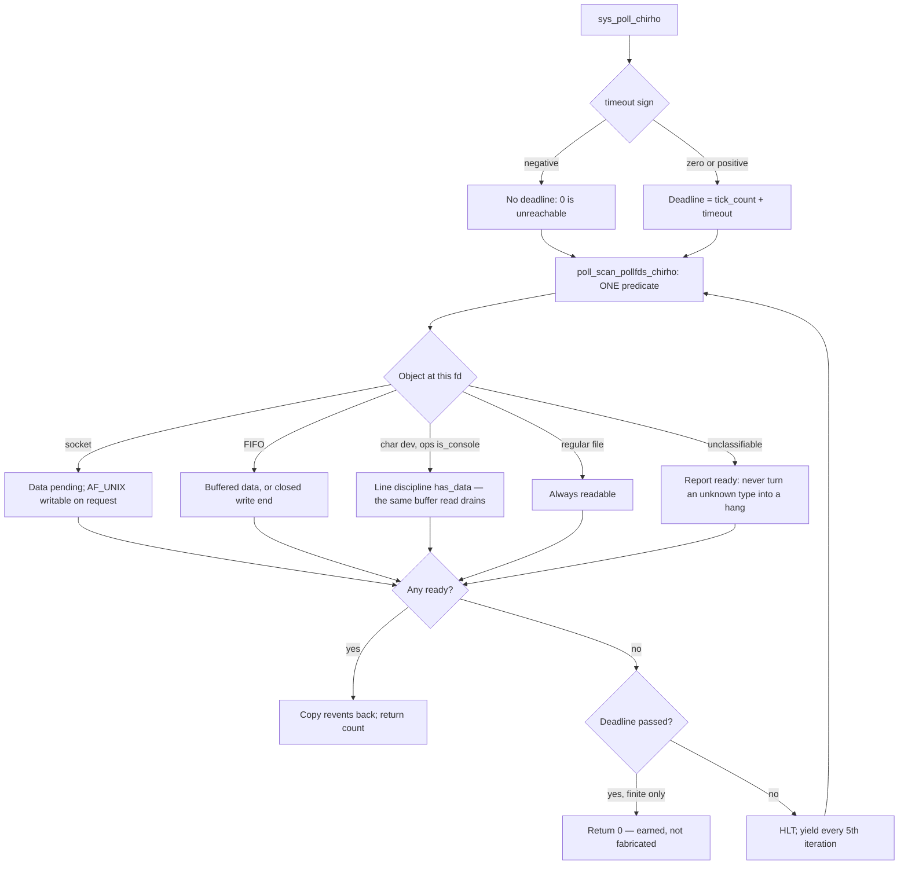
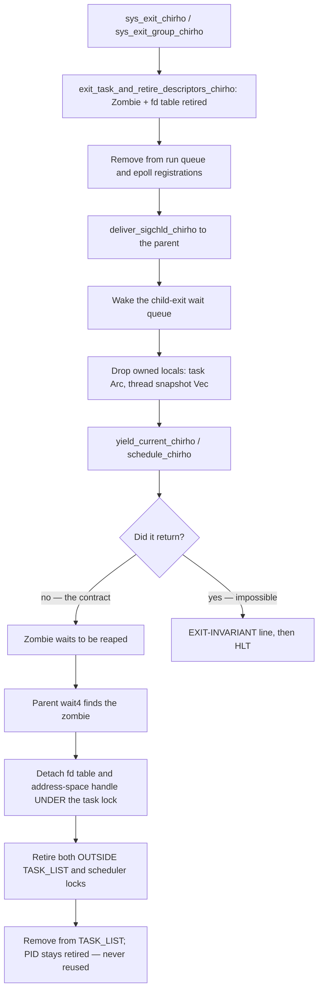

<!-- For God so loved the world, that he gave his only begotten Son, that whosoever believeth in him should not perish, but have everlasting life. — John 3:16 (KJV) -->

# Process exit lifecycle Chirho

This workflow owns how a user task blocks, how it dies, and how its parent
learns about it. Those three are one workflow because a defect in the first
produced a workaround in the second that hid a bug in the third for the whole
life of the boot shell.

The governing rule: **no exit decision may be made from a PID value.** PID is an
identity, not a role. Every numeric role test that lived on this path
misclassified something.

That rule is the target, **not yet the state of the code.** `exit` and
`exit_group` now satisfy it; `sys_select` does not. Read the RED section before
treating any of this as green.

## Blocking contract (precondition for everything below)

`poll(2)` must never manufacture a timeout. A negative timeout means "block
indefinitely" and may not return `0`; `0` means a single non-blocking scan; a
positive timeout may return `0` only once its deadline has genuinely passed,
measured against the timer-ISR tick counter.

This mattered far beyond `poll`. When it returned `0` to an indefinite wait,
BusyBox read that impossible result as the end of its line-edit wait and exited
cleanly — which is what the exit-path workarounds below were built to paper over.

Readiness is a property of the **object** behind a descriptor, never of the
descriptor NUMBER and never of the polling process. One predicate serves the
first pass and every retry pass; divergent readiness copies are the defect,
because an object can then be ready to one pass and invisible to another.

The yield inside that loop is an **internal scheduler handoff**. It must not
become a return value. Leaking it out as `0` is precisely the defect that made
`poll(-1)` answer a timeout.

## Console identity

The console has two representations: the devtmpfs node for `/dev/console`
(major 5, minor 0 or 1, carrying `DevNodeDataChirho`), and the boot stdio
objects installed by init, which reuse a dummy inode with `fs_data_chirho: None`.

Both carry `DEV_CONSOLE_OPS_CHIRHO`, so **identity lives on the ops object**
(`FileOpsChirho::is_console_chirho`). Discriminating on inode payload finds the
first and misses the second — the fd 0 that every shell actually polls — which
leaves the predicate decorative exactly where it matters.

## Exit

One path for `exit` and `exit_group` — but **not yet for every route out of a
task.** See the RED section below: `sys_select` can still terminate a task from
inside a numeric PID test. The diagram describes the unified path, not a
property the whole kernel currently holds.

Two rules on this diagram are load-bearing:

- **Drop owned locals before the handoff.** These functions never return, so
  their frames never unwind. A task `Arc` or a heap `Vec` left alive there is
  leaked permanently even after reap removes the task — a bounded-growth defect
  distinct from fd or page-table retirement.
- **The impossible return must be loud.** Silently entering `HLT` makes a
  violated invariant indistinguishable from any other hang. The
  `EXIT-INVARIANT` line names the PID and which scheduler call returned. It is
  a permanent failing input, not a temporary trace.

## SIGCHLD has no ppid==0 sentinel

`deliver_sigchld_chirho` must not treat parent PID `0` as "no parent". **PID 0
is a real task here — it is the user login shell.** Treating it as a sentinel
silently discarded SIGCHLD for every child the boot shell forked, so it never
reaped them and boot stalled. The lookup that follows already handles a
genuinely absent parent, which made the guard both wrong and redundant.

This is the concrete cost of inferring roles from PID values, and it is why the
re-exec workarounds existed at all: the kernel could not notify the shell, so it
faked forward progress by killing the parent and re-execing a shell in the
corpse's context.

## Removed, and why they must not come back

| Removed | Why it existed | Why it was wrong |
| --- | --- | --- |
| `sys_exit` post-yield BusyBox relaunch | Restart a shell that "had no parent" | Nothing tested for a parent; it ran after every exit that resumed, and hid a scheduled Zombie |
| `exit_group` `PID < 3` split | Treat PID 1/2 as the boot shell | The shell is PID 0; it caught an ordinary `mkdir -p` child and destroyed its parent |
| `wait4` fast path (`parent_pid` 3..=7) | Avoid a "slow" xkbcomp | xkbcomp was broken, not slow; this SIGKILLed it and fabricated exit status 0 |
| `ppid == 0` SIGCHLD sentinel | "init has no parent to notify" | PID 0 is the login shell; this was the blocker under all of the above |

## RED — open, not fixed

### `sys_select` still exits tasks by PID

`sys_select_chirho` carries a forced-exit path gated on `sel_pid_chirho >= 3`
plus socket `CloseWait` (`syscall_chirho.rs` ~5005–5096). It calls
`exit_task_and_retire_descriptors_chirho`, delivers SIGCHLD, removes the task
from the scheduler, calls `schedule_chirho`, and can then `return 0` — with **no
`EXIT-INVARIANT` line**, so a resumed continuation there is silent.

That is a numeric-role exit decision, exactly the class the rule above forbids,
and it is live. It belongs to the later PID-policy slice.

`sys_select_chirho` also fabricates timeout-zero on **three** paths — the same
defect repaired in `poll`, still unrepaired here:

| Site | Trigger | Why it is fabricated |
| --- | --- | --- |
| ~4978 | every 100th call, after X11_READY, for service PIDs | no deadline consulted |
| ~4993 | every 100th iteration | sits three lines under a comment reading "DON'T return 0" |
| ~5068 | an out-of-band scan finds pipe data | comment calls it "no fds ready, timeout expired" though no deadline was checked — and the pipe need not be in the caller's `readfds` at all |

The third is the worst of them: it reports a timeout to a caller whose watched
descriptors were never consulted.

Wider: **69 load-bearing PID gates across 8 kernel files** make boot behaviour
depend on process launch order.

### Context-slot aliasing

`BOOT_SLOT_CHIRHO` computes `MAX_PIDS_CHIRHO - 1` = **127** while its own
comment claims **63** and calls it "never used as a real PID". Real PID 127
aliases the boot context slot; PIDs 128+ are rejected with a null context slot.

Current boots show zero context-slot failures **because process churn no longer
reaches PID 127 — not because the aliasing is fixed.** Raising the limit or
recycling PIDs only moves the collision. PID identity and context-slot ownership
need separating before this is green.
