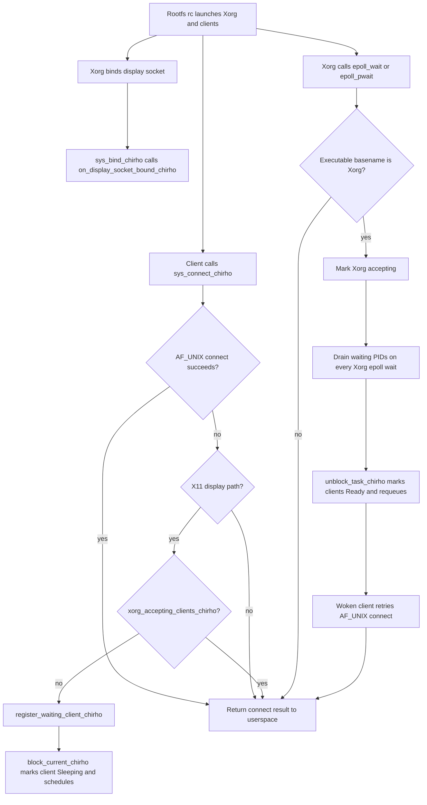

<!-- For God so loved the world, that he gave his only begotten Son, that whosoever believeth in him should not perish, but have everlasting life. — John 3:16 (KJV) -->

# X11 Bring-up Workflow Chirho

The rootfs rc script is the single launcher for Xorg and its clients.
`x11_bringup_chirho.rs` owns readiness and the waiting-client queue;
`net_core_chirho.rs` reports socket events and parks clients; the epoll syscall
dispatch reports Xorg event-loop entry.

The readiness log is one-shot, but the waiting-PID drain is not latched. A
client may park after Xorg's first wait, so every later Xorg wait must drain the
queue. `X11_READY_CHIRHO` remains only as a temporary console-trace input; it is
not readiness authority.

Production proof gate: a KVM serial log must show which wait primitive Xorg
actually calls. If no Xorg epoll syscall appears, the epoll hook is unreachable
and this workflow must move its accepting transition to the primitive Xorg does
use rather than widening a PID gate.
