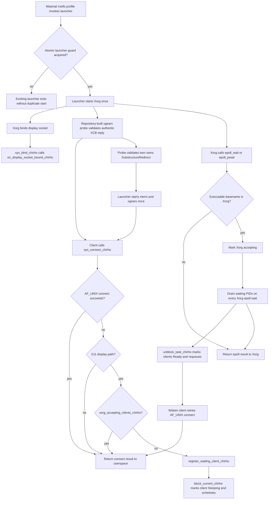

<!-- For God so loved the world, that he gave his only begotten Son, that whosoever believeth in him should not perish, but have everlasting life. — John 3:16 (KJV) -->

# X11 Bring-up Workflow Chirho

The material rootfs `/etc/profile` invokes
`/usr/local/sbin/start-lineluya-desktop-chirho.sh`, which is the single launcher
for Xorg and its clients. A rootfs-owned atomic directory guard prevents a
second launcher; VFS does not synthesize profile or Xorg configuration content.
`x11_bringup_chirho.rs` owns readiness and the waiting-client queue;
`net_core_chirho.rs` reports socket events and parks clients; the epoll syscall
dispatch reports Xorg event-loop entry.

The readiness log is one-shot, but the waiting-PID drain is not latched. A
client may park after Xorg's first wait, so every later Xorg wait must drain the
queue. `X11_READY_CHIRHO` remains only as a temporary console-trace input; it is
not readiness authority.

Production proof gate: the KVM serial log must show Xorg's executable-identified
event-loop entry, authentic XCB setup success, twm ownership, and successful
wake/retry for any client that parked early. If Xorg dies before readiness, the
parked-client failure path must wake waiters so the launcher's bounded teardown
can report failure rather than sleeping forever.
