<!-- For God so loved the world, that he gave his only begotten Son, that whosoever believeth in him should not perish, but have everlasting life. — John 3:16 (KJV) -->

# X11 Evidence Cohort Workflow Chirho

`scripts-chirho/evidence-chirho/run-x11-desktop-cohort-chirho.sh` is the
authoritative host-direct runtime gate for the PRD's native-KVM cohort. The
runner measures an already-built kernel/rootfs pair. It never rebuilds between
attempts, mutates the hashed base rootfs, selects successful runs after a
failure, or treats serial volume as a milestone.

The default is acceptance-strict: a clean identified revision, `qemu64`, KVM,
no forbidden or unclassified kernel source markers, no unmarked unconditional
serial-emitter calls outside explicit stable exceptions, no recognizable direct
named-sink or literal-COM1 bypass of the inventoried serial emitters, no
synthetic xkbcomp policy in source, and a maximum 400-second timeout. Exploratory runs
may explicitly set `REQUIRE_CLEAN_SOURCE_CHIRHO=0` or
`REQUIRE_TRACE_FREE_CHIRHO=0`; the resulting metadata marks dirty source as
ineligible for acceptance.

```mermaid
flowchart TD
    source_inventory_chirho[Extract every alphabetic bracket marker that begins a kernel string]
    emitter_graph_chirho[Derive serial-emitting macros transitively from low-level sinks]
    emitter_calls_chirho[Classify every unconditional emitter call as marked, stable unmarked, or unknown]
    serial_bypass_chirho[Reject direct named-sink and literal COM1 writes outside the derived emitters]
    source_classification_chirho[Classify forbidden shape, known forbidden, location-locked stable, or unknown]
    source_gate_chirho{Clean revision and zero source-preflight failures?}
    artifact_gate_chirho{Kernel and base rootfs exist?}
    kvm_gate_chirho{Native KVM and qemu64?}
    cohort_hash_chirho[Hash source-controlled assets and immutable artifacts]
    next_attempt_chirho[Allocate next unique attempt and loopback port]
    port_gate_chirho{Port free?}
    scratch_chirho[Reflink or copy unique writable scratch rootfs]
    scratch_hash_chirho{Scratch hash equals base hash?}
    qemu_start_chirho[Start QEMU with a temporary kernel-disk snapshot]
    startup_gate_chirho{QEMU and short HMP socket alive?}
    milestone_watch_chirho[Record first-observed milestone seconds]
    fatal_gate_chirho{Fatal guest or QEMU signal?}
    before_capture_chirho[Capture first PPM and physical framebuffer after Xorg launch]
    desktop_gate_chirho{Xorg, xkbcomp, twm, xterm PTY, xgears complete?}
    after_capture_chirho[Capture post-client PPM and physical framebuffer]
    authenticity_gate_chirho{No synthesis, duplicate launch, or temp trace?}
    framebuffer_gate_chirho{Physical range readable, changed, and nonblank?}
    immutable_gate_chirho{Base rootfs hash unchanged?}
    attempt_pass_chirho[Record attempt pass]
    attempt_fail_chirho[Preserve first divergence and stop cohort]
    cohort_done_chirho{Requested consecutive count reached?}
    cohort_pass_chirho[Record unselected consecutive cohort pass]
    manual_framebuffer_review_chirho[Separate Gate C: manually verify recognizable client output in the image]

    source_inventory_chirho --> source_classification_chirho --> source_gate_chirho
    emitter_graph_chirho --> emitter_calls_chirho --> source_gate_chirho
    serial_bypass_chirho --> source_gate_chirho
    source_gate_chirho -- no --> attempt_fail_chirho
    source_gate_chirho -- yes --> artifact_gate_chirho
    artifact_gate_chirho -- no --> attempt_fail_chirho
    artifact_gate_chirho -- yes --> kvm_gate_chirho
    kvm_gate_chirho -- no --> attempt_fail_chirho
    kvm_gate_chirho -- yes --> cohort_hash_chirho --> next_attempt_chirho --> port_gate_chirho
    port_gate_chirho -- no --> attempt_fail_chirho
    port_gate_chirho -- yes --> scratch_chirho --> scratch_hash_chirho
    scratch_hash_chirho -- no --> attempt_fail_chirho
    scratch_hash_chirho -- yes --> qemu_start_chirho --> startup_gate_chirho
    startup_gate_chirho -- no --> attempt_fail_chirho
    startup_gate_chirho -- yes --> milestone_watch_chirho --> fatal_gate_chirho
    fatal_gate_chirho -- yes --> attempt_fail_chirho
    fatal_gate_chirho -- no --> before_capture_chirho --> desktop_gate_chirho
    desktop_gate_chirho -- no, timeout --> attempt_fail_chirho
    desktop_gate_chirho -- yes --> after_capture_chirho --> authenticity_gate_chirho
    authenticity_gate_chirho -- no --> attempt_fail_chirho
    authenticity_gate_chirho -- yes --> framebuffer_gate_chirho
    framebuffer_gate_chirho -- no --> attempt_fail_chirho
    framebuffer_gate_chirho -- yes --> immutable_gate_chirho
    immutable_gate_chirho -- no --> attempt_fail_chirho
    immutable_gate_chirho -- yes --> attempt_pass_chirho --> cohort_done_chirho
    cohort_done_chirho -- no --> next_attempt_chirho
    cohort_done_chirho -- yes --> cohort_pass_chirho
    cohort_pass_chirho -. runner cannot certify semantic pixels .-> manual_framebuffer_review_chirho
```



## Evidence boundaries Chirho

- QEMU receives the kernel boot disk through a temporary snapshot overlay. The
  guest sees writable block semantics, while the hashed source image remains
  untouched.
- Every rootfs scratch path contains the attempt's unique port and runner PID.
  The initial hash must match the immutable base; the final scratch hash is
  recorded before bounded cleanup.
- HMP monitor sockets use a short `/tmp/lx11-*` path because Linux AF_UNIX
  socket paths are limited to 108 bytes. Descriptive evidence directories are
  too long for that transport path.
- HMP `pmemsave` captures the exact physical address and byte length reported
  by the guest. The output length must match, and the runner records raw hashes,
  the number of changed bytes, and whether the after buffer contains nonzero
  bytes. PNG conversion is supplemental review evidence, not the measured
  source.
- The first physical capture occurs after the launcher reports Xorg, but the
  launcher can start clients between the runner's one-second observations. The
  automatic changed/nonzero check therefore proves framebuffer plumbing and
  mutation only. It does **not** prove that a client produced recognizable
  output. Manual image inspection is a separate Gate C requirement and remains
  RED until a reviewer records that evidence.
- A failure stops the cohort immediately. The next manual cohort starts from
  attempt one after the first divergence is understood; the runner never fills
  a five-run table by skipping a failed attempt.
- The trace-free preflight extracts every bracketed token beginning with an
  alphabetic character that starts a Rust string in `kernel-chirho/src`.
  TRACE/DBG/DIAG segments and PID-numbered windows are structurally forbidden
  first. The legacy temporary-marker list then supplies reasons for
  already-known names; it is not the completeness mechanism. Stable exceptions
  are locked to source path plus occurrence count, avoiding line-number pins
  while ensuring a newly added same-token site fails closed. Every other token
  is unclassified. Lowercase `[heap]` and `[stack]` are location-locked to their
  legitimate `/proc/maps` VMA-name source; lowercase `[e1000]` is not waived.
- A path-plus-count lock is an accidental-change guard, not site identity: a
  same-file delete and replacement using the same token can preserve the count.
  Reviewers must inspect the classification artifact when changing a locked file.
- Marker extraction cannot see a trace with no marker. The runner therefore
  parses every top-level kernel macro definition, builds a transitive graph from
  the current low-level serial sinks, and inventories every call to the derived
  unconditional emitters. `fb_println_chirho!`, `serial_print_chirho!`,
  `serial_println_chirho!`, and the currently unused `log_irq_chirho!` are found
  from their definitions rather than maintained as a call-site list. The seven
  `debug_serial` adapters are excluded only while their complete definition
  hashes match reviewed cfg-gated bodies. New wrappers and changed gated bodies
  fail closed.
- Marked emitter calls remain governed by the marker classifier. Every
  expression-based, bare-newline, or unmarked-literal call fails unless its
  emitter/path count has an explicit stable-output exception. The current
  `fb_println_chirho!` exception covers seven boot-banner strings and three bare
  separators in `main_chirho.rs`; it has the same same-file replacement residual
  as the marker locks. Direct calls to `_print_chirho` or
  `serial_write_bytes_chirho`, plus recognizable literal writes to COM1 port
  `0x3f8`, bypass the macro-call inventory and therefore fail separately.
- The five calls to `serial_write_line_chirho` in `fb_device_chirho.rs` are not
  counted again: the wrapper's three direct low-level sink sites already make
  the source preflight fail, so new callers cannot turn that wrapper green.
- This is a fail-closed proof over the kernel's current named serial sinks,
  derived macro convention, and recognizable literal COM1 writes. It is not a
  Rust whole-program proof that no alias, inline assembly, or future
  hardware-output mechanism can exist. Adding another low-level output path
  requires extending and revalidating the preflight before it can support an
  acceptance claim.
- The same preflight separately rejects `WAIT4-FAST`/`GPF-HLT-SKIP` policy
  markers and the kernel-supplied `server-0.xkm` fallback. Runtime checks remain
  necessary because stable invariant guards are allowed in source but must
  never fire.
- Gate E uses the same runner only after a separate rebuild from the same
  identified source revision. It must point at the newly produced artifacts,
  not reuse the Gate D binaries.

## Source-only preflight Chirho

The source classifier can run without QEMU artifacts or `/dev/kvm`:

```bash
rtk env \
  SOURCE_PREFLIGHT_ONLY_CHIRHO=1 \
  REQUIRE_CLEAN_SOURCE_CHIRHO=0 \
  REQUIRE_TRACE_FREE_CHIRHO=0 \
  bash scripts-chirho/evidence-chirho/run-x11-desktop-cohort-chirho.sh
```

Disabling the two requirements makes this an exploratory inventory command,
not an acceptance pass. Leave `REQUIRE_TRACE_FREE_CHIRHO=1` to prove that a
nonzero inventory exits unsuccessfully before any QEMU process starts.

At the 2026-08-26 hardening checkpoint, revision `fae950185fcb` contains 231
distinct source-string markers: 31 location-locked stable exceptions, 16
structurally forbidden names, 13 known forbidden names, and 171 unclassified
names. The derived graph contains 11 serial emitters: four unconditional and
seven exact-hash-gated debug adapters. Its 635 unconditional-emitter calls split
into 541 marked and 94 unmarked calls; ten boot-banner calls are explicit stable
exceptions and 84 remain unclassified failures. Thirty source sites bypass the
macro-call inventory: four direct named-sink calls and 26 literal COM1 writes.
With zero emitter-definition, exception-rule, or synthetic-keymap failures, the
resulting 314 failed predicates make trace-free status explicitly RED. A source
behavior may violate more than one predicate, so 314 is not a count of unique
runtime traces.
These numbers are a frozen checkpoint, not a substitute for rerunning the
executable preflight after each owner's attributable cleanup slice.
