<!-- For God so loved the world, that he gave his only begotten Son, that whosoever believeth in him should not perish, but have everlasting life. — John 3:16 (KJV) -->

# X11 Evidence Cohort Workflow Chirho

`scripts-chirho/evidence-chirho/run-x11-desktop-cohort-chirho.sh` is the
authoritative host-direct runtime gate for the PRD's native-KVM cohort. The
runner measures an already-built kernel/rootfs pair. It never rebuilds between
attempts, mutates the hashed base rootfs, selects successful runs after a
failure, or treats serial volume as a milestone.

The default is acceptance-strict: a clean identified revision, `qemu64`, KVM,
no temporary trace markers or known synthetic xkbcomp policy in source, and a
maximum 400-second timeout. Exploratory runs
may explicitly set `REQUIRE_CLEAN_SOURCE_CHIRHO=0` or
`REQUIRE_TRACE_FREE_CHIRHO=0`; the resulting metadata marks dirty source as
ineligible for acceptance.

```mermaid
flowchart TD
    source_gate_chirho{Clean revision and forbidden-source scan empty?}
    artifact_gate_chirho{Kernel and base rootfs exist?}
    kvm_gate_chirho{Native KVM and qemu64?}
    cohort_hash_chirho[Hash source-controlled assets and immutable artifacts]
    next_attempt_chirho[Allocate next unique attempt and loopback port]
    port_gate_chirho{Port free?}
    scratch_chirho[Reflink or copy unique writable scratch rootfs]
    scratch_hash_chirho{Scratch hash equals base hash?}
    qemu_start_chirho[Start QEMU with a temporary kernel-disk snapshot]
    startup_gate_chirho{QEMU and short HMP socket alive?}
    milestone_watch_chirho[Record first-observed milestone seconds]
    fatal_gate_chirho{Fatal guest or QEMU signal?}
    before_capture_chirho[Capture pre-client PPM and physical framebuffer]
    desktop_gate_chirho{Xorg, xkbcomp, twm, xterm PTY, xgears complete?}
    after_capture_chirho[Capture post-client PPM and physical framebuffer]
    authenticity_gate_chirho{No synthesis, duplicate launch, or temp trace?}
    framebuffer_gate_chirho{Physical bytes changed and remain nonblank?}
    immutable_gate_chirho{Base rootfs hash unchanged?}
    attempt_pass_chirho[Record attempt pass]
    attempt_fail_chirho[Preserve first divergence and stop cohort]
    cohort_done_chirho{Requested consecutive count reached?}
    cohort_pass_chirho[Record unselected consecutive cohort pass]

    source_gate_chirho -- no --> attempt_fail_chirho
    source_gate_chirho -- yes --> artifact_gate_chirho
    artifact_gate_chirho -- no --> attempt_fail_chirho
    artifact_gate_chirho -- yes --> kvm_gate_chirho
    kvm_gate_chirho -- no --> attempt_fail_chirho
    kvm_gate_chirho -- yes --> cohort_hash_chirho --> next_attempt_chirho --> port_gate_chirho
    port_gate_chirho -- no --> attempt_fail_chirho
    port_gate_chirho -- yes --> scratch_chirho --> scratch_hash_chirho
    scratch_hash_chirho -- no --> attempt_fail_chirho
    scratch_hash_chirho -- yes --> qemu_start_chirho --> startup_gate_chirho
    startup_gate_chirho -- no --> attempt_fail_chirho
    startup_gate_chirho -- yes --> milestone_watch_chirho --> fatal_gate_chirho
    fatal_gate_chirho -- yes --> attempt_fail_chirho
    fatal_gate_chirho -- no --> before_capture_chirho --> desktop_gate_chirho
    desktop_gate_chirho -- no, timeout --> attempt_fail_chirho
    desktop_gate_chirho -- yes --> after_capture_chirho --> authenticity_gate_chirho
    authenticity_gate_chirho -- no --> attempt_fail_chirho
    authenticity_gate_chirho -- yes --> framebuffer_gate_chirho
    framebuffer_gate_chirho -- no --> attempt_fail_chirho
    framebuffer_gate_chirho -- yes --> immutable_gate_chirho
    immutable_gate_chirho -- no --> attempt_fail_chirho
    immutable_gate_chirho -- yes --> attempt_pass_chirho --> cohort_done_chirho
    cohort_done_chirho -- no --> next_attempt_chirho
    cohort_done_chirho -- yes --> cohort_pass_chirho
```

## Evidence boundaries Chirho

- QEMU receives the kernel boot disk through a temporary snapshot overlay. The
  guest sees writable block semantics, while the hashed source image remains
  untouched.
- Every rootfs scratch path contains the attempt's unique port and runner PID.
  The initial hash must match the immutable base; the final scratch hash is
  recorded before bounded cleanup.
- HMP monitor sockets use a short `/tmp/lx11-*` path because Linux AF_UNIX
  socket paths are limited to 108 bytes. Descriptive evidence directories are
  too long for that transport path.
- HMP `pmemsave` captures the exact physical address and byte length reported
  by the guest. The output length must match, and the runner records raw hashes,
  the number of changed bytes, and whether the after buffer contains nonzero
  bytes. PNG conversion is supplemental review evidence, not the measured
  source.
- A failure stops the cohort immediately. The next manual cohort starts from
  attempt one after the first divergence is understood; the runner never fills
  a five-run table by skipping a failed attempt.
- The trace-free preflight scans kernel Rust source for the maintained
  temporary-marker inventory, the `WAIT4-FAST`/`GPF-HLT-SKIP` policy markers,
  and the kernel-supplied `server-0.xkm` fallback before QEMU starts. Runtime
  checks remain necessary because stable invariant guards are allowed to exist
  in source but must never fire.
- Gate E uses the same runner only after a separate rebuild from the same
  identified source revision. It must point at the newly produced artifacts,
  not reuse the Gate D binaries.
